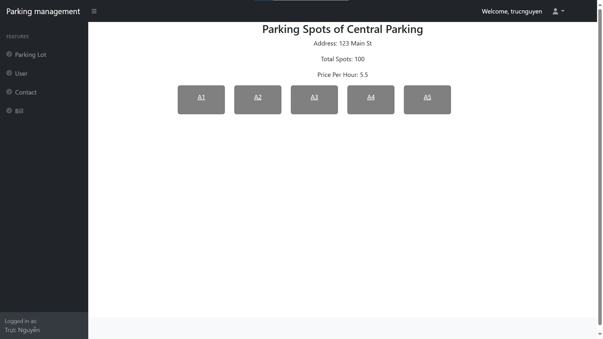
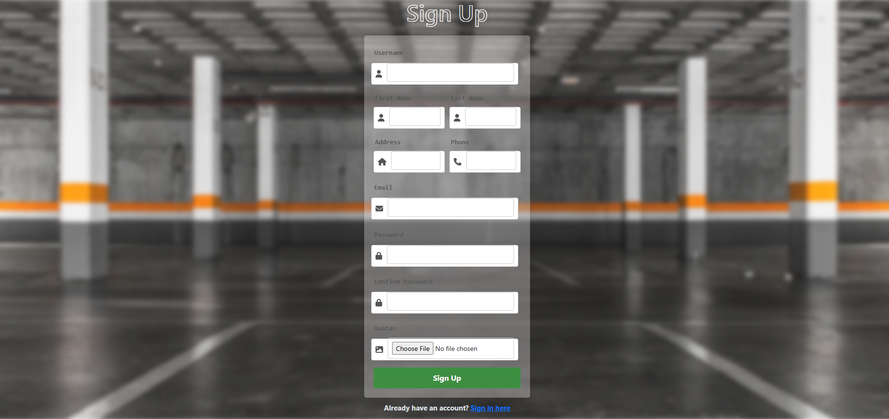

# Smart Parking Management

## Overview

**Smart Parking Management** is a system used to manage parking spaces. The system is built on the Spring framework, using the MVC model to build the admin management and combined with it is the RESTful APIs architecture to provide APIs for the system. On the user side, ReactJs will be used to build the interface.

## Database

<p align="center">

</p>

## Installation and Usage

_This readme contains installations and usages for Spring Framework & ReactJs_

To ensure the project runs smoothly, please follow the recommended version information to avoid potential errors: JDK version 14, Tomcat 9.0, and NetBeans 13 as the IDE for running the application.

### Installation

Using MySQL, create a database named `parkingmanagement`, then execute the `flightManagement.sql` file located in the project's `scripts` folder.

#### Add environment variables

_On the backend_

Edit the following properties in the `application.properties` file.

```bash
#Edit Spring email to verification
...
spring.mail.username=your_email
...
```

Edit the following properties in the `database.properties` file.

```bash
...
hibernate.connection.url=your_connection #default connection is jdbc:mysql://localhost:3306/your_database_name
hibernate.connection.username=your_database_username
hibernate.connection.password=your_database_password
```

#### Install dependencies

_On the frontend_
We use yarn to manage packages.
Install dependencies for the project

```bash
yarn install
```

Run project

```bash
yarn start
```

### Usages

_Admin interface_

<div style="display: flex; justify-content: space-between;">
  
  
  
  
  
  
</div>

_User interface_

<div style="display: flex; justify-content: space-between;">
  
  
  
  
  
  
  
  
  
</div>

### Contact

_The project is still under development. If you have any contributions, please contact us at trucntt278.work@gmail.com_
